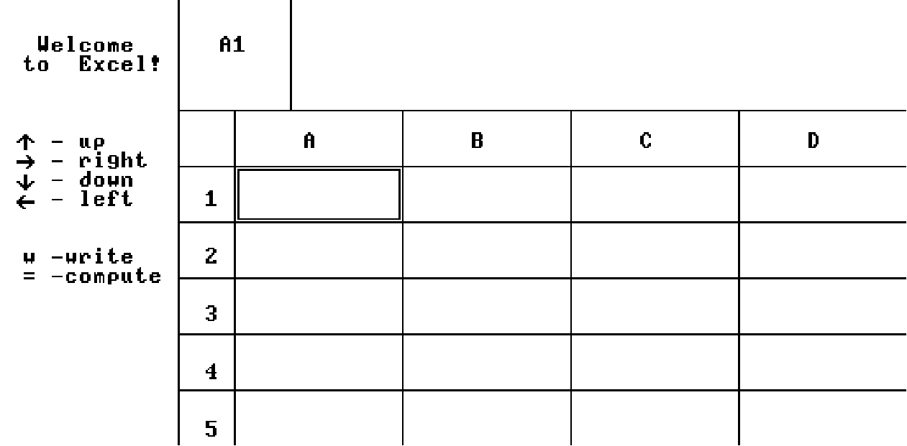

# Excel in Jack Language

Этот репозиторий содержит простую реализацию приложения Excel с использованием языка программирования Jack.

## Screenshot

## Game Controls

Используйте клавиши со стрелками для перемещения по таблице, w - для записи чисел и строк, = - для записи и вычисления выражения, esc - для завершения программы.
